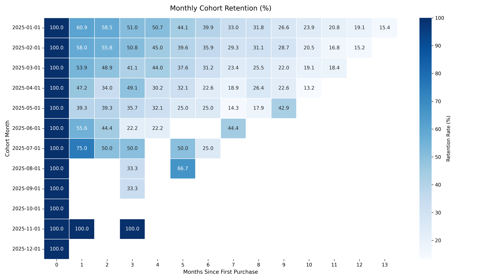

# Customer Cohort Retention and RFM Segmentation Analysis

This project analyzes raw transactional e-commerce data to evaluate customer retention and purchasing behavior over time. The entire analysis is written in PostgreSQL-compliant SQL using DuckDB, focusing on window functions, Common Table Expressions (CTEs), and date-based aggregations.

The goal was to solve two practical business problems:
1. Track monthly cohort decay to see how many customers return after their first purchase.
2. Group customers into actionable segments (Champions, Loyal, At Risk, Churned) based on Recency, Frequency, and Monetary (RFM) metrics.

---

## 1. Cohort Retention Analysis

I used a multi-step CTE approach to construct the retention matrix:
* First, I determined each customer's acquisition date using `MIN(order_date)` and truncated it to the first of the month.
* Next, I calculated the month offset (`period_index`) between their first purchase and every subsequent transaction.
* Finally, I aggregated distinct customer counts across cohorts and calculated retention percentages relative to Month 0.

### Retention Matrix Heatmap

### Key Observation
Acquisition cohorts show an initial retention drop to roughly 20-25% in Month 1, followed by a steady baseline retention of 12-16% through Month 6.

---

## 2. RFM Segmentation Logic

To categorize customer value, I built an RFM model using the `NTILE(5)` window function:
* **Recency:** Days between the customer's last order and the analysis cutoff date (`2026-03-01`). Inverted so that lower days yield a higher score.
* **Frequency:** Total unique orders placed by the customer.
* **Monetary:** Total cumulative spend across all orders.

Each customer received a score from 1 to 5 for each dimension. I then mapped these combinations into business tiers using conditional logic:

| Segment | Criteria | Business Action |
| :--- | :--- | :--- |
| **Champions** | R >= 4, F >= 4, M >= 4 | Early access to new products, loyalty perks |
| **Loyal Customers** | R >= 3, F >= 3 | Upselling and cross-selling campaigns |
| **Recent Inactive / New** | R >= 4, F <= 2 | Onboarding emails to drive second purchase |
| **At Risk / Churning** | R <= 2, F >= 3 | Win-back discounts and targeted outreach |
| **Lost / Hibernating** | Default | Low-cost automated email re-engagement |

---

## 3. Rolling Revenue Trends

To measure underlying revenue momentum without daily sales spikes, I calculated rolling metrics using window frames:
* **7-Day Moving Average:** `AVG(daily_sales) OVER (ORDER BY order_date ROWS BETWEEN 6 PRECEDING AND CURRENT ROW)`
* **30-Day Moving Average:** `AVG(daily_sales) OVER (ORDER BY order_date ROWS BETWEEN 29 PRECEDING AND CURRENT ROW)`
* **Running Total:** `SUM(daily_sales) OVER (ORDER BY order_date ROWS BETWEEN UNBOUNDED PRECEDING AND CURRENT ROW)`

---

## Repository Structure
customer-analytics-advanced-sql/
├── 01_cohort_retention.sql # SQL script for cohort matrix calculations
├── 02_rfm_segmentation.sql # SQL script for RFM scoring and customer tiers
├── 03_moving_averages_kpis.sql # SQL script for rolling revenue and trends
├── advanced_sql_customer_analytics.ipynb # Google Colab notebook running DuckDB
├── cohort_retention_matrix.png # Rendered heatmap image
├── rfm_segmentation_summary.csv # Exported summary table of customer segments
└── README.md # Documentation

---

## How to Run

The SQL queries in this repository can be run in any PostgreSQL database or inside Python via DuckDB.

To run the full pipeline in Google Colab:
1. Open `advanced_sql_customer_analytics.ipynb`.
2. Run all cells sequentially. The script generates the sample transactional dataset, executes the queries in memory, renders the chart, and exports the `.sql` and `.csv` files.
